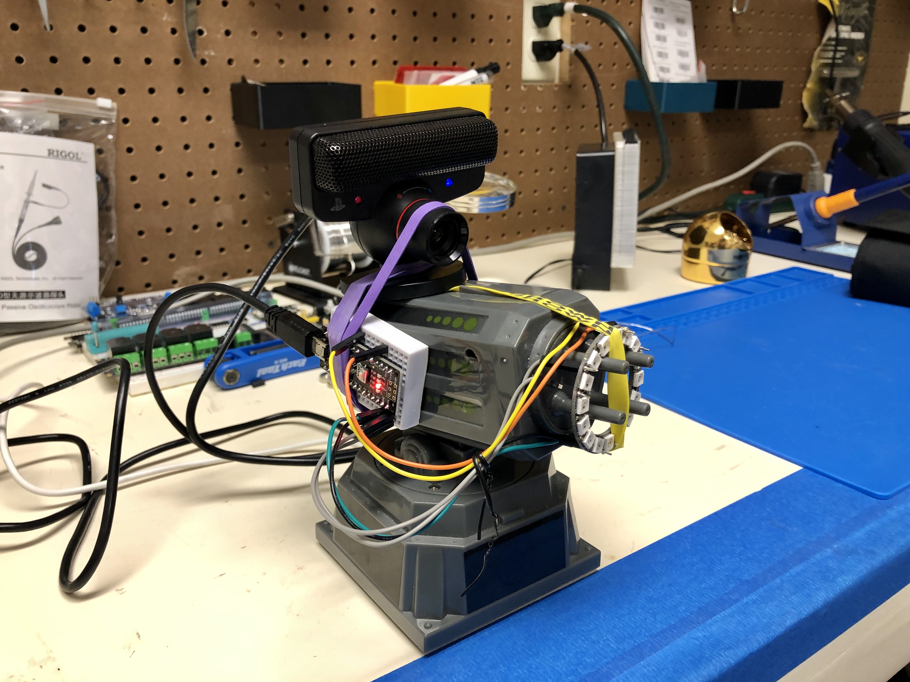

# sentry



**Control a USB Sentry Turret with Python on a Raspberry Pi**

The script installs **motion**, a webcam server and the dependencies to run the turret control script.

# Installation

```bash
$ bash -v <(curl -sL https://raw.githubusercontent.com/nrobinson2000/sentry/master/install.sh)
```

# Usage

## Web interface:

The web interface allow you to view the stream from the motion server and control the movement of the turret, as well as the lights on the front. Move with the arrow keys or clicking on the image, and press enter to toggle the light. You can also use the color picker to set a custom color.

Running the app:

```bash
$ ./app.sh
```
*To close the screen and leave the app running press CTRL-A +D*

Open a browser window to view the app.

Example:

```
http://sentry.local
```

## Command line utility:

Use the arrow keys to move the turret, press CTRL-C to exit.

```bash
$ cd cli/
$ ./sentry-control.py
```

## Python scripting:

```
$ cd cli/
$ python3

>>> from sentry import sentry 	# Load the sentry module
>>> sentry.up() 		# Move the sentry upwards
>>> sentry.down() 		# Move the sentry downwards
>>> sentry.left() 		# Move the sentry left
>>> sentry.right() 		# Move the sentry right
>>> sentry.stop() 		# Stop any movement in progress
>>> sentry.fire() 		# Fire the cannon
```

# Parts List

* Rasperry Pi - I had a spare [3 Model B](https://www.raspberrypi.org/products/raspberry-pi-3-model-b/)
* Arduino Nano - Any one will do. I used a chinese clone that featured a USB micro B port.
* Playstation Eye Camera - Cheap but reliable.
* Dream Cheeky 908 Thunder Missile Launcher - A long discontinued product that I found in my house.
* NeoPixel Ring with 16 pixels - A bright RGB LED ring that can be bought from [Adafruit.](https://www.adafruit.com/product/1463)
* Jumper wires to connect the NeoPixel to the Arduino Nano
* Rubber bands to secure everything to the launcher

# Credits

https://github.com/nmilford/stormLauncher

https://timmurphy.org/2018/09/30/reading-keyboard-input-with-python/
